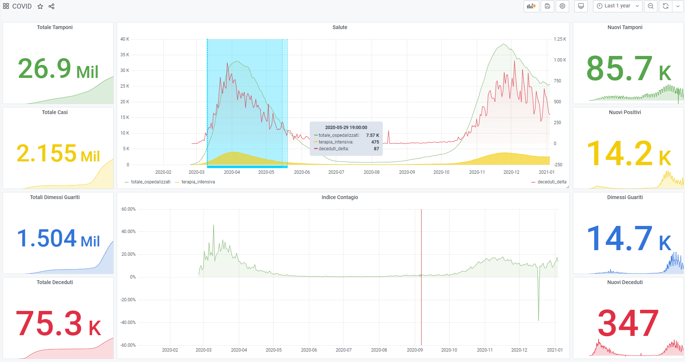

# Project
Build a dashboard about COVID19 flue using open data available for italian country without a single line of code.

The result:

> Activities

- data collection: collects Italian COVID19 data from [Presidenza del Consiglio dei Ministri - Dipartimento della Protezione Civile](https://github.com/pcm-dpc/COVID-19) Github repository: https://github.com/pcm-dpc/COVID-19/blob/master/dati-andamento-nazionale/dpc-covid19-ita-andamento-nazionale.csv
- data processing: importing CSV data to MariaDB
- data analytics: design new COVID19 dashboard

> Tools

The low-level tool used to import and process data is [Nodered](https://nodered.org/). 

The dashboard are build using [Grafana](https://grafana.com/).

# Implementation

- nodered-etl.json: the flow executed by  Nodered
- mariadb.sql: the mariadb schema creation
- grafana-dashboard.json: the grafana dashboard 

